<h1 align="center">Gotta catch 'em all!</h1>

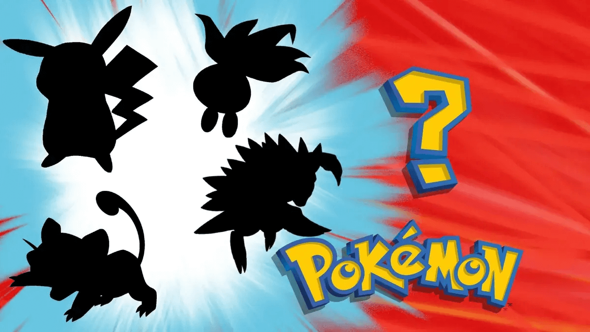

<h3 align="center"><a href="https://davidtausend.github.io/pokemon-memory-cards-game/">➡️ View the live project here ⬅️</a></h3>

 

## Introduction

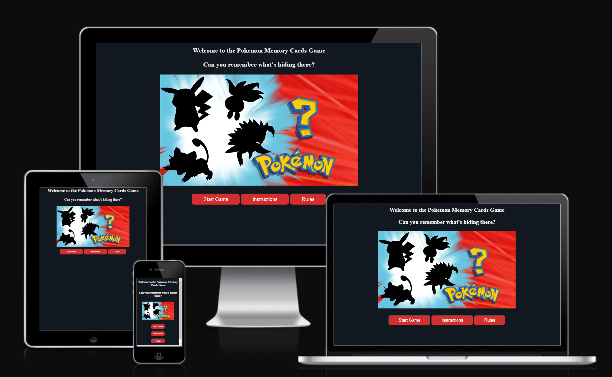

Experience the fun and challenge of the Pokémon Memory Card Game, designed for all ages with vibrant graphics and beloved Pokémon characters. Start your engaging Pokémon adventure now!

 

## Table of Contents

- [Introduction](#introduction)
- [Table of Contents](#table-of-contents)
- [User Experience (UX)](#user-experience--ux-)
  * [User Stories](#user-stories)
    + [User goals](#user-goals)
    + [Company goals](#company-goals)
- [Design](#design)
  * [Color Scheme](#color-scheme)
  * [Components](#components)
  * [Imagery](#imagery)
  * [Wireframes](#wireframes)
    + [Main Menu](#main-menu)
    + [Game Screen](#game-screen)
    + [End of Game Screen](#end-of-game-screen)
- [Features](#features)
  * [Player's Name](#player-s-name)
    + [Regular Expression](#regular-expression)
  * [Music](#music)
  * [Score](#score)
    + [High Score](#high-score)
  * [Reset Game](#reset-game)
  * [Timer](#timer)
  * [Schuffle cards](#schuffle-cards)
  * [Keyboard](#keyboard)
  * [Quit Game](#quit-game)
    + [Confirm Quit Game](#confirm-quit-game)
  * [Future Implementations](#future-implementations)
    + [Multiplayer Mode](#multiplayer-mode)
    + [Additional Levels and Difficulty Settings](#additional-levels-and-difficulty-settings)
    + [Social Media Integration](#social-media-integration)
    + [Mobile App Version](#mobile-app-version)
    + [Customizable Themes](#customizable-themes)
    + [Game Progress Save](#game-progress-save)
    + [Feedback](#feedback)
    + [Pokemon API Integration](#pokemon-api-integration)
    + [Achievements and Rewards](#achievements-and-rewards)
    + [Database](#database)
- [Technologies](#technologies)
  * [Programming Languages](#programming-languages)
  * [Applications, Plugins & Tools Used](#applications--plugins---tools-used)
- [Deployment & Local Development](#deployment---local-development)
  * [Deployment](#deployment)
  * [Local Development](#local-development)
    + [How to Fork](#how-to-fork)
    + [How to Clone](#how-to-clone)
    + [Committing and Pushing Changes](#committing-and-pushing-changes)
- [Testing](#testing)
  * [Automated Testing](#automated-testing)
    + [Validator Testing](#validator-testing)
      - [HTML](#html)
      - [CSS](#css)
      - [JavaScript](#javascript)
    + [LightHouse](#lighthouse)
      - [Desktop](#desktop)
      - [Mobile](#mobile)
      - [Improvements](#improvements)
      - [Final Score](#final-score)
      - [Accessibility](#accessibility)
  * [Manual testing](#manual-testing)
    + [User Stories Testing](#user-stories-testing)
    + [Full Testing](#full-testing)
      - [Devices](#devices)
      - [Browsers](#browsers)
  * [Bugs](#bugs)
    + [Known Bugs](#known-bugs)
    + [Solved Bugs](#solved-bugs)
- [Credits](#credits)
  * [Content](#content)
    + [External Articles and Guides](#external-articles-and-guides)
    + [Community Contributions and Forums](#community-contributions-and-forums)
    + [Design and Spacing Techniques](#design-and-spacing-techniques)
  * [Software Design Documentation](#software-design-documentation)
  * [Media](#media)
  * [Acknowledgments](#acknowledgments)

[Generate TOC](https://ecotrust-canada.github.io/markdown-toc/)

 

## User Experience (UX)

The Pokémon Memory Card Game, with its user-centered design, offers a simple, fun, and nostalgic experience for all ages, emphasizing intuitive play and the classic appeal of Pokémon.

### User Stories

#### User goals

- Users seek a fun and challenging memory card game with familiar Pokemon characters.
- The game should be easy to understand with clear instructions, suitable for all ages.
- Expectations include clickable cards, responsive buttons, and an interactive interface.
- Desirable for an enriched gaming experience.
- Users want to see and improve their scores during gameplay.

#### Company goals

- Aim to keep users engaged and encourage repeated plays.
- Leverage Pokemon themes to appeal to a broad audience and enhance brand recognition.
- Ensure the game is accessible to users of varying abilities.
- Ensure seamless performance across various devices.

## Design

### Typography

The Pokemon Memory Card Game utilizes the Roboto font, imported from Google Fonts, to enhance readability and aesthetics. This choice of typography contributes to the game's modern and user-friendly interface.

### Color Scheme

The game's color scheme is dynamic and engaging, drawing from the colorful Pokemon universe: 

- Primary Background: Dark blue (#12181f), offering a striking contrast.
- Text Color: White (#FFFFFF) for readability against the dark background.
- Button Color: Dark red (#D32F2F) with white text, highlighting interactivity.
- Card Background: Neutral, emphasizing the colorful Pokemon images.
- Modal Background: Gray black (#333), ensuring focus on content.
- Interactive Elements: Include hover effects and animations for engagement.

### Components

The game incorporates various UI components, each contributing to an engaging user experience:

1. Header Section: Includes the game title, a welcome message, and a responsive image.

2. Main Game Area: Features a card grid, a timer, a score counter, and action buttons like "Start Game," "Instructions," and "Music Settings."

3. Card Elements: Interactive Pokemon cards with flip and shake animations.

4. Modal Windows: Instruction and music setting modals with overlay design.

5. Responsive Design: Media queries for adaptability across devices.

6. Interactive Buttons: For various game actions, styled to match the game theme.

7. Score List: Displays the top 5 high scores to motivate players to beat their previous records, dynamically updating to reflect ongoing performance.

### Imagery

The Pokemon Memory Card Game uses themed imagery, like hidden Pokemon in the header and individual Pokemon on cards, to create an engaging experience. Images adapt responsively across devices, ensuring a consistent and visually appealing interface for the game.

### Wireframes

Wireframes for the Pokemon Memory Card Game detail the layout and user interaction. They include the game area, action buttons, and modals for instructions and music, guiding the development of a cohesive, user-friendly interface.

#### Main Menu 

<kbd>&nbsp;</kbd>

<kbd>&nbsp;</kbd>

#### Game Screen

<kbd>&nbsp;</kbd>

<kbd>&nbsp;</kbd>

#### End of Game Screen

<kbd>&nbsp;</kbd>

<kbd>&nbsp;</kbd>

## Features

### Player's Name

The player is able to give the name in the Pokemon Memory Card Game, a regular expression validates player names to only include alphabetic characters and spaces. This ensures consistent and proper name formatting, enhancing user experience.

#### Regular Expression

The regular expression `^[A-Za-z\s]+$` is used in the game for validating player names. This pattern ensures that only alphabetic characters and spaces are allowed, preventing entries with numbers or special characters. If the entered name doesn't match the pattern, the user is alerted, and the input isn't accepted. This feature maintains data consistency and enhances user experience by ensuring proper name formats.

- The regular expression `^[A-Za-z\s]+$` is used. This means:
  - `^` asserts the start of a line.
  - `[A-Za-z]` allows uppercase and lowercase letters.
  - `\s` allows spaces.
  - `+` indicates one or more of the preceding elements.
  - `$` asserts the end of a line.

### Music

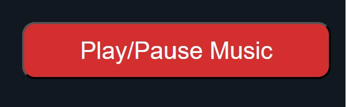

Music plays a significant role in enhancing the gameplay experience. A background track adds to the game's ambiance, creating an engaging atmosphere. Players have control over the music with features to play, pause, and adjust the volume. This functionality not only personalizes the experience but also makes the game more accessible and enjoyable for all users, regardless of their audio preferences.

### Score

The scoring system in the "Pokemon Memory Card Game" adds a competitive element:

- Points increase by 100 for correct matches, rewarding memory and accuracy.
- Incorrect matches deduct 100 points, adding challenge.
- The timer influences the final score, encouraging speed.
- High scores are recorded for personal best tracking.

#### High Score

The High Score feature in the Pokemon Memory Card Game enhances competitiveness:

- High scores are recorded, showcasing players' top performances.
- A leaderboard displays the top 5 scores with player names.
- Scores are saved locally, allowing players to track their progress.
- This feature motivates players to improve and replay for higher scores.

### Reset Game

The Reset Game feature in the Pokemon Memory Card Game enables players to restart their game, resetting the score, reshuffling cards, and resetting the timer, ensuring a fresh gameplay experience each time.

### Timer

In the Pokemon Memory Card Game, a timer starts with the first card flip, displaying time in minutes and seconds. It adds an element of challenge, allowing players to track their speed. The timer resets for each new game, ensuring consistent time tracking.

### Schuffle cards

The game shuffles the Pokemon cards before each round, ensuring a unique and challenging experience each time. This randomization is key to the memory aspect of the game, as it prevents memorization of card positions from previous games.

### Keyboard

The game integrates keyboard navigation, enabling players to interact with the game using keyboard inputs: left, right and enter to select the card. This feature enhances accessibility, allowing users who prefer or require keyboard navigation to fully engage with the game.

### Quit Game

A "Quit Game" feature is available, providing players with an option to exit the game session. This feature is particularly useful for users who wish to end their current game and return to the main menu or close the application.

#### Confirm Quit Game

Upon selecting "Quit Game," a confirmation prompt is displayed, ensuring that players don't accidentally exit their game. This additional step helps prevent unintended game closures, offering a user-friendly experience by safeguarding players' game progress.

### Future Implementations

#### Keyboard Functionality

Implementing 'Up' and 'Down' arrow keys for comprehensive navigation support.

#### Multiplayer Mode

Adding a feature for players to compete against friends.

#### Additional Levels and Difficulty Settings

Implement different levels of difficulty, from easy to hard, catering to various age groups and skill levels.

#### Social Media Integration

 Enabling score sharing and friend invites through social media.

#### Mobile App Version

Creating a mobile app version for on-the-go gaming.

#### Customizable Themes

Allowing players to personalize game themes and card designs.

#### Game Progress Save

Implementing a save feature for pausing and resuming games.

#### Feedback

Creating a platform for players to submit suggestions and feedback.

#### Pokemon API Integration

Incorporating the [PokeAPI](https://pokeapi.co/) to expand the card collection, adding a dynamic and ever-growing range of Pokemon cards to the game. This feature will enrich the game's diversity and appeal to a broader audience of Pokemon enthusiasts.

#### Achievements and Rewards

Implementing a rewards system for achieving certain milestones in the game.

#### Database

Future updates for the Pokemon Memory Card Game will include integrating a database to save and compare player scores, enabling leaderboard features for enhanced competition and engagement.

## Technologies

### Programming Languages

- [HTML5](https://en.wikipedia.org/wiki/HTML5)
- [CSS3](https://en.wikipedia.org/wiki/CSS)
- [JavaScript](https://en.wikipedia.org/wiki/JavaScript)

### Applications, Plugins & Tools Used

[Gitpod](https://www.gitpod.io): Gitpod served as my primary IDE for HTML, CSS, and JavaScript development, offering a seamless environment for coding and real-time change previews.

[Github](https://github.com/): Github was essential for repository hosting, enabling code sharing, and project management.

[Favicon](https://www.flaticon.com/): Flaticon provided a range of social media icons suitable for use as favicons on the site.

[Mycolor](https://mycolor.space/): Assisted in selecting a cohesive color palette, significantly impacting the website's aesthetic and user experience.

[Tiny](https://tinypng.com/): TinyPNG was instrumental in compressing images for the web, reducing file sizes without substantial quality loss and improving website loading times.

[Git](https://git-scm.com/): Employed for version control, facilitating efficient code changes management and team collaboration.

[ChatGPT](https://chat.openai.com/auth/login): Provided assistance in content creation, spell-checking, and code improvement suggestions, especially in accessibility and semantic naming.

[Shields](https://shields.io/): Used to create and integrate badges into the README for enhanced project documentation.

[Resize images](https://www.iloveimg.com/resize-image): Utilized for resizing images, ensuring they fit well within the website's design while maintaining quality. This tool was crucial for optimizing images for different screen sizes and improving the overall visual presentation of the site.

[Am I Responsive](https://ui.dev/amiresponsive): This tool was used to display how the website looks across different devices, ensuring responsive design.

[Lighthouse](https://chromewebstore.google.com/detail/lighthouse/blipmdconlkpinefehnmjammfjpmpbjk?hl=de): Employed for auditing the website's performance, accessibility, and SEO, providing insights for improvements and optimizations.

[Wave](https://wave.webaim.org/): Used for assessing website accessibility, Wave helped identify and rectify accessibility issues, ensuring the site's usability for a diverse range of users. This tool was integral in making the website more inclusive and adhering to accessibility standards.

[Preview](https://support.apple.com/de-de/guide/preview/welcome/mac): Preview was utilized for image editing tasks like resizing and color adjustments, as well as for viewing images. Its ease of use and versatility made it a valuable tool in managing and modifying visual assets for the project.

[Slack](https://slack.com): Used for engaging with the Code Institute's online community, Slack was crucial for asking questions, exchanging ideas, and receiving guidance, significantly aiding in the project's development.

[Google Chrome](https://www.google.com/): Key for testing and debugging, Chrome's Developer Tools were essential for live editing and responsive design checks.

[Balsamiq](https://balsamiq.com): Utilized in the initial design phase, Balsamiq helped in creating wireframes, aiding in the visual and structural planning of the website.

[Python Tutor](https://pythontutor.com/javascript.html#mode=edit): Used for visualizing JavaScript code execution, aiding in debugging.

[JS Code quality tool](https://jshint.com/): Employed to analyze JavaScript code for errors and enforce coding standards.

[Web Vitals](https://web.dev/articles/vitals?hl=de): Monitored the site's performance and user experience metrics.

[Contrast Checker](https://webaim.org/resources/contrastchecker/): Ensured text and background combinations met accessibility standards.

[Esprima](https://esprima.org/demo/validate.html): This JavaScript validator was vital for syntax parsing, ensuring code correctness and debugging assistance.

[Regular Expression](https://regexr.com/): Used to test and refine regular expressions, crucial for validating user inputs and enhancing data integrity.

## Deployment & Local Development

### Deployment

The site is deployed using GitHub Pages - [pokemon-memory-cards-game](https://davidtausend.github.io/pokemon-memory-cards-game/)

To deploy the site using GitHub Pages:

1. Login (or signup) to GitHub.
2. Go to the repository for this project: [DavidTausend/pokemon-memory-cards-game](https://davidtausend.github.io/pokemon-memory-cards-game/)
3. Click the settings button.
4. Select "Pages" in the left-hand navigation menu.
5. From the source dropdown, select the "main" branch and press save.

The site has now been deployed. Please note that this process may take a few minutes before the site goes live.

### Local Development

#### How to Fork

To fork the repository:

1. Log in (or sign up) to GitHub.
2. Go to the repository for this project: [DavidTausend/pokemon-memory-cards-game](https://davidtausend.github.io/pokemon-memory-cards-game/)
3. Click the "Fork" button in the top right corner.

#### How to Clone

To clone the repository:

1. Log in (or sign up) to GitHub.
2. Go to the repository for this project: [DavidTausend/pokemon-memory-cards-game](https://davidtausend.github.io/pokemon-memory-cards-game/)
3. Click on the "Code" button, select whether you would like to clone with HTTPS, SSH, or GitHub CLI, and copy the link shown.
4. Open the terminal in your code editor and change the current working directory to the location you want to use for the cloned directory.
5. Type `git clone` into the terminal and then paste the link you copied in step 3. Press enter.

#### Committing and Pushing Changes

After making changes to your local copy, you can commit and push them to GitHub:

1. Open the terminal in the directory of your cloned repository.
2. Use `git status` to see the changes you've made.
3. Use `git add .` to stage all changes for commit, or `git add <filename>` to stage specific files.
4. Use `git commit -m "Your commit message here"` to commit your changes with a descriptive message.
5. Use `git push origin main` to push your changes to the main branch on GitHub.

## Testing

### Automated Testing

#### Validator Testing

##### HTML

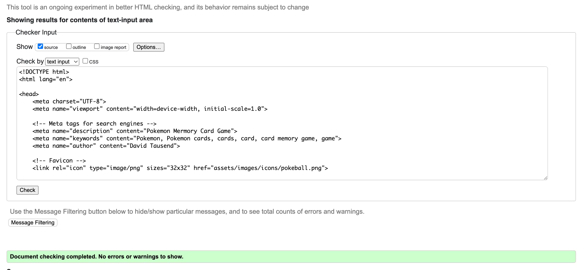

The W3C Markup Validator confirms the HTML is error-free, ensuring compliance with web standards, as indicated by the Lighthouse report.

##### CSS

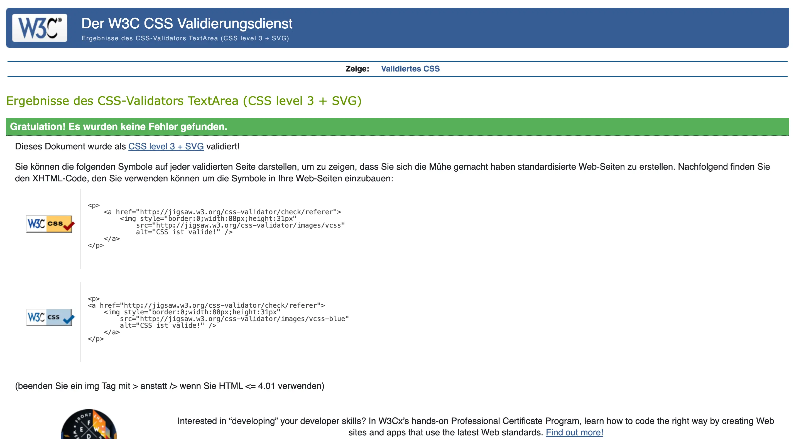

Validated error-free by the Jigsaw validator, the CSS effectively enhances the site's performance and cross-browser compatibility, as shown in the Lighthouse report.

##### JavaScript

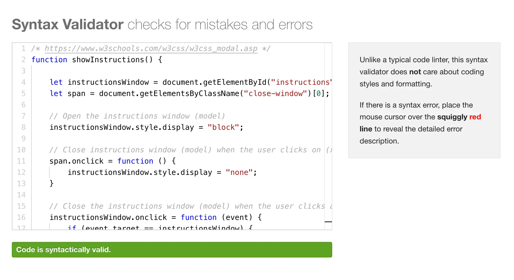

Employed JSHint, a JavaScript Code Quality Tool and the esprima validator confimrs that the JavaScript code passed without any major issues.

#### LightHouse

Lighthouse was employed to evaluate the website's performance, accessibility, best practices, and SEO via Chrome Developer Tools. Future plans include regular Lighthouse audits to continually enhance these aspects, ensuring optimal site efficiency and user experience.

##### Desktop

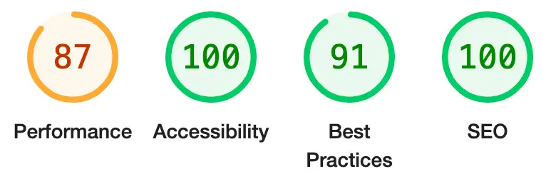

##### Mobile

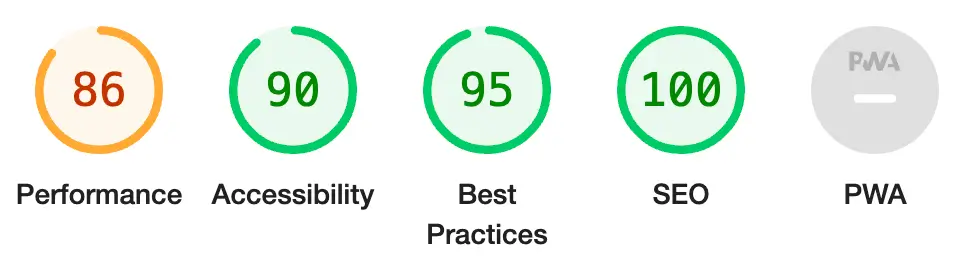

##### Improvements

##### Final Score

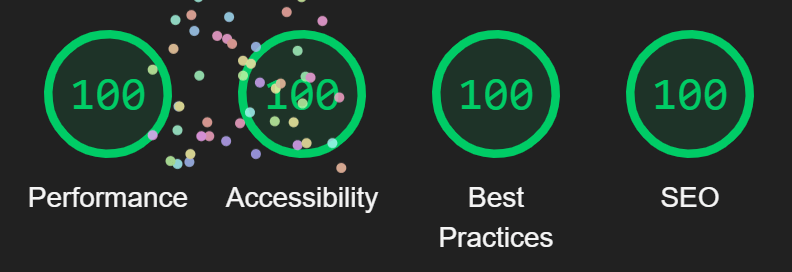

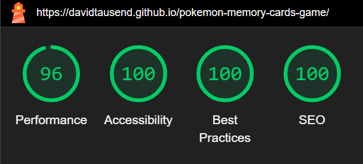

##### Accessibility

Accessibility testing was conducted using WAVE and Lighthouse tools, ensuring the website is user-friendly for a diverse audience. Regular assessments are planned for ongoing accessibility improvements.

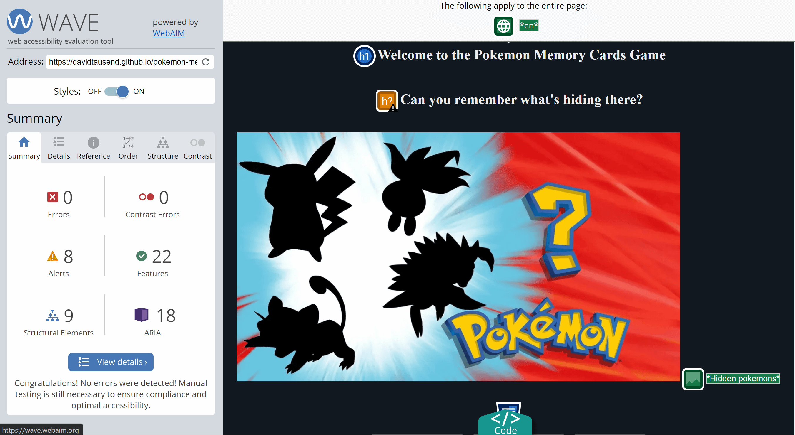

### Manual testing

#### User Stories Testing

`User Goals`

| User Goals | How are they achieved? |
| :------------------------------------------------------------------------------------ | :---------------------------------------------------------------------------------------- |
|I want an engaging and fun memory game to play.|Implemented a Pokémon-themed card memory game that's both challenging and enjoyable.|
|I need the game to be accessible on various devices.|Responsive design ensures the game is playable on desktops, tablets, and mobiles.|
|I want clear instructions on how to play the game.|Added an 'Instructions' button that opens a modal with easy-to-understand game rules.|
|I want to control the game's background music.|Integrated a Music Settings allowing players to adjust the volume or toggle the music.|
|I enjoy visually appealing games.|Designed with attractive Pokémon card images and engaging animations.|
|I prefer games that are easy to navigate.|Simple and intuitive UI with accessible buttons and straightforward navigation.|

`Company Goals`

| Company Goals | How are they achieved? |
| :------------------------------------------------------------------------------------ | :---------------------------------------------------------------------------------------- |
|We aim to provide an entertaining gaming experience.|Developed an immersive Pokemon memory game that's fun and captivating for players.|
|We want to attract a wide range of users.|Ensured cross-device compatibility and a universally appealing Pokémon theme.|
|We aim to create a user-friendly game interface.|Implemented a clean and intuitive design with easy-to-use controls and instructions.|
|We want to offer customizable user experiences.|Provided music control options to cater to different user preferences.|
|We aim to maintain user engagement and retention.|Included various Pokémon characters and a scoring system to keep players engaged.|
|We plan to expand our game with more features.|Future implementations like multiplayer mode and more card sets are planned to enhance the game.|

#### Full Testing

##### Devices

- 24-inch Desktop Monitor
- 13-inch MacBook Pro
- 11 inch iPad Pro
- iPhone 14 PRO Max
- Samsung S20 Ultra

##### Browsers

- Google Chrome
- Firefox
- Safari
- Edge
- Samsung Internet

 

`Player's Name`

| Feature | Expected Outcome | Testing Performed | Result | Pass/Fail |
| --------------------------- | --------------------------------------------------------------------------------------------- | ------------------------------- | ----------------------------------------------------- | --------- |
|Name Input Validation|The game should accept only alphabetic characters and spaces in the name field.|Tested name submission with various inputs including numbers and special characters.|The game correctly accepted names with letters and spaces, and alerted when invalid characters were used.|Pass ✅|
|Responsiveness of Name Input|The name input field should be easily accessible and functional on all devices.|Tested the responsiveness and functionality of the name input on different devices and browsers.|Name input was responsive and worked as expected on all tested devices and browsers.|Pass ✅|
|Interaction with Game Progress|Entering a name should not affect the game's progress or performance.|Tested game play before and after entering a name to observe any changes in game performance.|Game performance remained consistent and unaffected by the name entry.|Pass ✅|

`Music`

| Feature | Expected Outcome | Testing Performed | Result | Pass/Fail |
| --------------------------- | --------------------------------------------------------------------------------------------- | ------------------------------- | ----------------------------------------------------- | --------- |
|Music Control Functionality|Players should be able to play, pause, and adjust the volume of the background music.|Tested the music controls across different devices and browsers.|Music controls functioned correctly, allowing for play, pause, and volume adjustment.|Pass ✅|
|Music Preference Retention|The game should remember the player's music settings even after restarting the game.|Tested restarting the game to check if music settings (volume, play/pause) are retained.|Music settings were successfully retained and restored after restarting the game.|Pass ✅|
|Background Music Responsiveness|Music should not interfere with game performance or responsiveness.|Tested game responsiveness while playing music on various devices.|Game remained responsive and performance was not affected by background music.|Pass ✅|
|Music Settings Accessibility|Music control options should be easily accessible and intuitive for users.|Evaluated the accessibility and ease of use of music controls for players.|Music settings were easily accessible and user-friendly across different devices.|Pass ✅|

`Score`

| Feature | Expected Outcome | Testing Performed | Result | Pass/Fail |
| --------------------------- | --------------------------------------------------------------------------------------------- | ------------------------------- | ----------------------------------------------------- | --------- |
|Accurate Score Calculation|Accurate Score Calculation|Tested scoring by matching and mismatching cards in the game.|Scores were calculated correctly, increasing for matches and decreasing for mismatches.|Pass ✅|
|Score Display Clarity|The score should be clearly displayed and easy to read during the game.|Checked the visibility and clarity of the score display on various devices.|The score was prominently displayed and easy to read on all tested devices.|Pass ✅|
|Score Reset on New Game|Score should reset to zero at the start of a new game.|Tested score reset functionality by starting new games.|Score reset to zero successfully at the beginning of each new game.|Score reset to zero successfully at the beginning of each new game.|
|Score Influence on Gameplay|The scoring system should motivate players to improve their performance.|Observed player reactions and feedback regarding the scoring system.|Players reported that the scoring system added a competitive element and motivated them to improve.|Pass ✅|

`High Score`

| Feature | Expected Outcome | Testing Performed | Result | Pass/Fail |
| --------------------------- | --------------------------------------------------------------------------------------------- | ------------------------------- | ----------------------------------------------------- | --------- |
|High Score Recording|High scores should be accurately recorded and stored.|Played multiple games to generate high scores and checked if they were correctly recorded.|High scores were accurately recorded and displayed in the high score list.|Pass ✅|
|High Score Display|High scores should be clearly displayed on the screen.|Reviewed the high score display on different devices and browsers.	|High scores were clearly visible and correctly formatted on all tested devices and browsers.|Pass ✅|
|High Score Persistence|High scores should persist between game sessions.|Tested the game on multiple occasions to see if high scores were retained.|High scores were consistently retained across different gaming sessions.|Pass ✅|
|High Score Limit	|Only the top scores should be displayed, limiting to a certain number (e.g., top 5).|Only the top scores should be displayed, limiting to a certain number (e.g., top 5).|The game successfully displayed only the top set number of high scores.|Pass ✅|

`Reset Game`

| Feature | Expected Outcome | Testing Performed | Result | Pass/Fail |
| --------------------------- | --------------------------------------------------------------------------------------------- | ------------------------------- | ----------------------------------------------------- | --------- |
|Game Reset Functionality|Clicking the 'Reset' button should reset the game to its initial state.|Tested the reset button in various game stages.|The game successfully reset to its initial state with shuffled cards and reset scores.|Pass ✅|
|Timer Reset on New Game|Timer should reset to zero at the start of a new game.|Checked the timer reset function by starting new games.|The timer reset to zero successfully at the beginning of each new game.|Pass ✅|
|Card Reset on New Game|All cards should return to their default state at the start of a new game.|Tested card state reset by starting new games after completing or during ongoing games.|Cards returned to their default state and shuffled correctly at the start of each new game.|Pass ✅|
|Score Reset on New Game|Score should reset to zero at the start of a new game.|Tested score reset functionality by starting new games.|Score reset to zero successfully at the beginning of each new game.|Pass ✅|

`Timer`

| Feature | Expected Outcome | Testing Performed | Result | Pass/Fail |
| --------------------------- | --------------------------------------------------------------------------------------------- | ------------------------------- | ----------------------------------------------------- | --------- |
|Timer Accuracy|The timer should accurately track game duration in minutes and seconds.|Monitored the timer during multiple games for accuracy.|The timer accurately reflected the elapsed game time in all tests.|Pass ✅|
|Timer Visibility|The timer should be clearly visible during gameplay.|Checked the visibility of the timer on various devices and screen sizes.|The timer was clearly visible and easily readable on all tested devices.|Pass ✅|
|Timer Reset Functionality|The timer should reset to 0:00 at the start of each new game.|Tested the timer reset function by starting new games.|The timer reset to 0:00 successfully at the start of each new game.|Pass ✅|
|Timer Continuity|The timer should run continuously without interruption unless the game is reset or completed.|Observed the timer's behavior during ongoing gameplay|The timer ran continuously and without interruption across all games.|Pass ✅|

`Schuffle cards`

| Feature | Expected Outcome | Testing Performed | Result | Pass/Fail |
| --------------------------- | --------------------------------------------------------------------------------------------- | ------------------------------- | ----------------------------------------------------- | --------- |
|Random Card Shuffling|Each new game should start with a randomly shuffled set of cards.|Started multiple games to check for randomness in card arrangement.|Cards were shuffled randomly at the beginning of each new game.|Pass ✅|
|Consistent Shuffle Mechanism|Shuffling mechanism should be consistent and unbiased.|Analyzed the shuffle algorithm and tested repeatedly.|The shuffle mechanism worked consistently and showed no patterns or biases.|Pass ✅|
|Shuffle on Game Reset|Cards should be reshuffled when the game is reset.|Tested card shuffling by using the reset feature during gameplay.|Cards were successfully reshuffled every time the game was reset.|Pass ✅|
|Shuffle Functionality Across Browsers|Card shuffling should work uniformly across different browsers.|Tested card shuffling on various browsers for consistency.|Shuffle functionality was consistent and effective on all tested browsers.|Pass ✅|

`Keyboard`

| Feature | Expected Outcome | Testing Performed | Result | Pass/Fail |
| --------------------------- | --------------------------------------------------------------------------------------------- | ------------------------------- | ----------------------------------------------------- | --------- |
|Keyboard Navigation|Players should be able to navigate and select cards using the keyboard.|Tested navigation and card selection with arrow keys and enter key.|Keyboard navigation was smooth and intuitive, with all functionalities accessible.|Pass ✅|
|Responsive Keyboard Inputs|Keyboard inputs should respond promptly without lag.|Tested responsiveness of keyboard inputs during gameplay.|Keyboard inputs were immediately responsive, ensuring a seamless gaming experience.|Pass ✅|
|Keyboard Accessibility|Game should be fully playable using only the keyboard.|Played the game using only keyboard controls to test full functionality.|The game was fully playable using the keyboard, enhancing accessibility for all users.|Pass ✅|
|Focus Indication|The card in focus should be clearly indicated when using keyboard navigation.|Checked for visual indication of the focused card when using the keyboard.|The focused card was clearly highlighted during keyboard navigation, aiding in usability.|Pass ✅|

`Quit Game`

| Feature | Expected Outcome | Testing Performed | Result | Pass/Fail |
| --------------------------- | --------------------------------------------------------------------------------------------- | ------------------------------- | ----------------------------------------------------- | --------- |
|Functionality of Quit Button|Clicking 'Quit Game' should initiate the quitting process.|Tested the 'Quit Game' button in various stages of gameplay.|The 'Quit Game' button functioned correctly, initiating the quitting process as intended.|Pass ✅|
|Confirm Quit Prompt|A confirmation prompt should appear after clicking 'Quit Game'.|Tested the appearance and functionality of the confirmation prompt.|The confirmation prompt appeared correctly after clicking 'Quit Game', asking for user confirmation.|Pass ✅|
|Cancellation of Quitting|Players should be able to cancel quitting and resume the game.|Tested the ability to cancel the quitting process and resume gameplay.|Cancellation of quitting worked effectively, allowing players to resume their game.|Pass ✅|
|Game State Preservation|Game state should remain unchanged if quitting is canceled.|Checked if the game state (score, timer, card positions) remained the same after canceling quitting.|The game state was successfully preserved when quitting was canceled.|Pass ✅|

`Confirm Quit Game`

| Feature | Expected Outcome | Testing Performed | Result | Pass/Fail |
| --------------------------- | --------------------------------------------------------------------------------------------- | ------------------------------- | ----------------------------------------------------- | --------- |
|Confirmation Functionality|Selecting 'Confirm' should successfully exit the game.|Tested the 'Confirm' button functionality within the confirmation modal.|Clicking 'Confirm' correctly exited the game and returned to the main menu.|Pass ✅|
|Game State Reset on Confirm|Game state should reset (score, timer, etc.) after confirming to quit.|Checked if the game state reset to initial values after confirming to quit.|Upon confirming to quit, the game state, including score and timer, was reset as expected.|Pass ✅|
|No Accidental Exits|Game should not exit without explicit confirmation from the player.|Tested various scenarios to ensure the game doesn't exit without player's confirmation.|The game remained active until the player explicitly confirmed to quit, preventing accidental exits.|Pass ✅|
|User Experience with Confirmation Modal|The confirmation modal should be user-friendly and clear.|Evaluated the design and clarity of the confirmation modal for user understanding.|The confirmation modal was user-friendly, with clear options for confirming or canceling the quit action.|Pass ✅|

### Bugs

#### Known Bugs

There are currently no known bugs in the Pokemon Memory Card Game. The game has been thoroughly tested across various platforms, devices, and scenarios to ensure a seamless and enjoyable gaming experience for all users.

#### Solved Bugs

## Credits

### Content

The content and design for the Pokémon Memory Card Game were developed by the creator, drawing inspiration from official Pokémon resources and classic memory card games. Game instructions, user interface text, and the unique scoring system were all originally created, while audio elements were selected to enhance the game's ambiance, with credit to their respective sources.

#### External Articles and Guides

- YouTube: For tutorial videos on web development and similar projects.

#### Community Contributions and Forums

- FreeCodeCamp Forum: A community platform for coding challenges and solutions.
- StackOverflow: Essential for solving coding issues and learning best practices.

#### Design and Spacing Techniques

- CSS-Tricks: Articles on CSS, with a focus on design and spacing.
- W3Schools: Tutorials for HTML, CSS and JS layout techniques.
- Github: I used my mentor's project as a guide for structuring and organizing my code effectively.

### Software Design Documentation

- YouTube: Educational content on software design principles.
- GitHub Project README: Detailed project documentation and design process.

### Media

### Acknowledgments

- My Mentor,[Matt Bodden](https://github.com/MattBCoding): Immense gratitude for his invaluable guidance, insightful feedback, and continuous support throughout the project.

- Code Institute Tutors and Staff: Thanks for their expertise and assistance, offering crucial support and resources for the project's development.

- Online Coding Communities: Appreciation for the knowledge and solutions shared on platforms like Stack Overflow and GitHub, aiding in problem-solving.

- Graphic and Audio Resource Contributors: Recognition for their artistic talents that added engaging dimensions to the game.

- Open Source Contributors: Acknowledgment of their shared resources and code snippets that enhanced the game's features.

- Personal Learning and Development: Acknowledgment of the growth and learning achieved, thanking all who contributed to this journey.

[Back to Top ^](#introduction)